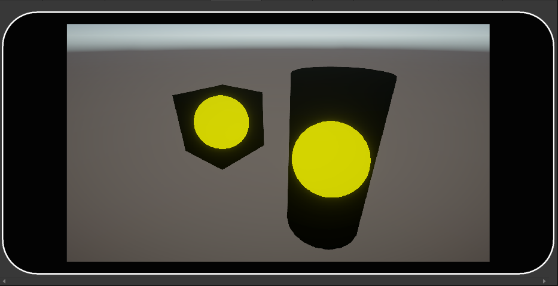
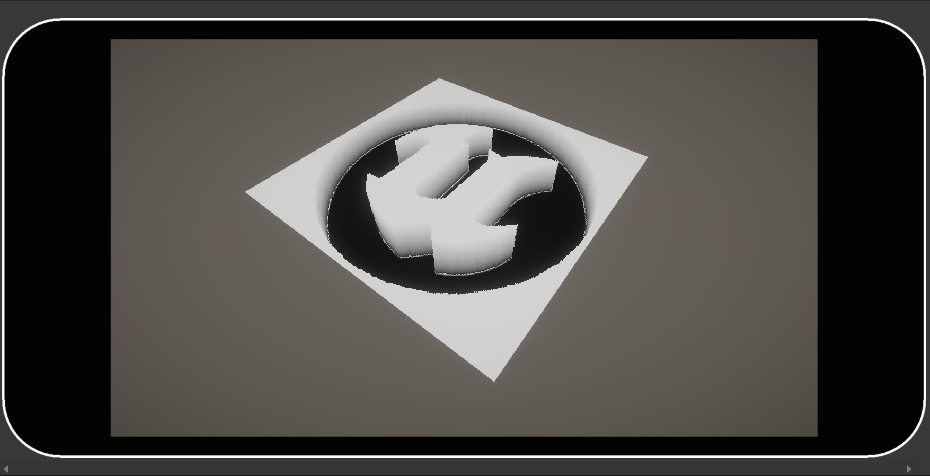
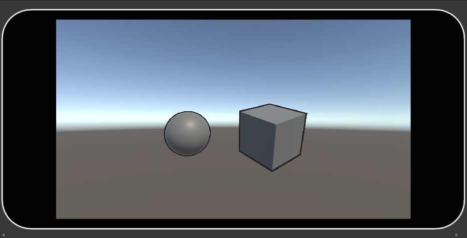
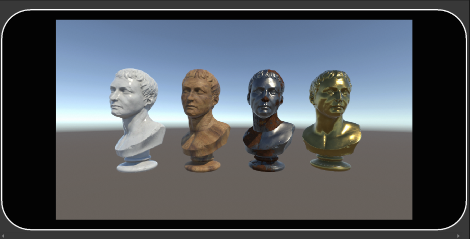

# Shader Playground

Welcome to my playground. It's about how I'm learning all the shader tech in unity. All the samples that I've made are listed below:

* IntroToRaymarching
* RaymarchingTexturesInDepth
* Outline Shader
* PBR Study

## IntroToRaymarchingRaymarchin

## RaymarchingTexturesInDepth

## Outline Shader

## PBR Study

